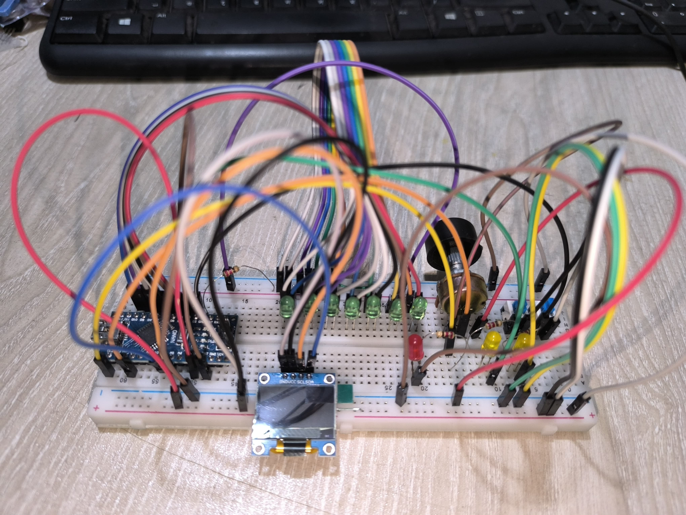
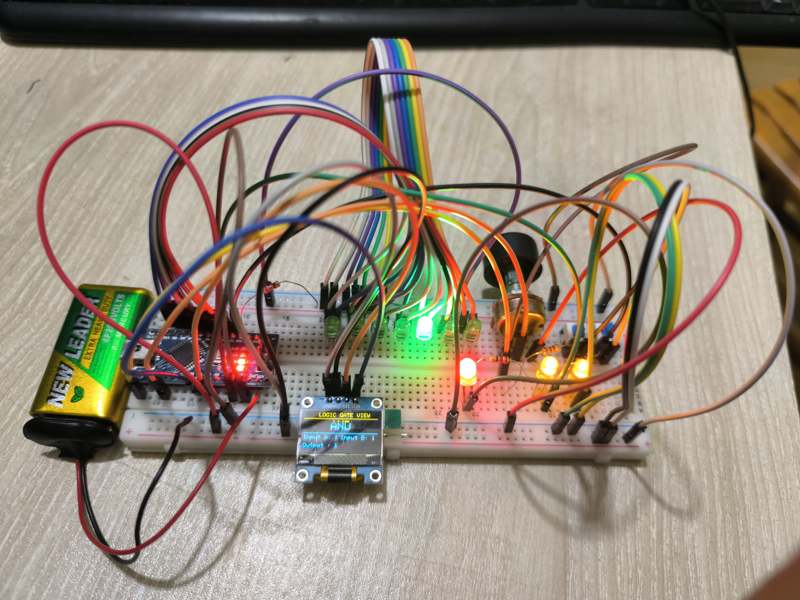

# Real-Time Implementation of All Basic Logic Gates Using Arduino Nano

---

## Project Overview
This project demonstrates a real-time implementation of all basic logic gates (NOT, AND, OR, NAND, NOR, XOR, XNOR) using an **Arduino Nano**. Inputs are provided via pushbuttons, and gate selection is done through a potentiometer.  

The output is displayed via an LED and a **128×64 SSD1306 OLED display**, showing the selected gate, input states, and output value in real-time. This setup serves as a verified educational tool for understanding digital logic operations.

---

## Hardware Components
- Arduino Nano  
- Pushbuttons (2)  
- LEDs (Yellow for inputs, Red for output, Green for gate indicators)  
- 10kΩ Potentiometer  
- SSD1306 OLED Display (128×64)  
- Resistors, Breadboard, Jumper Wires  

---

## Results
- Successfully implemented and tested all seven basic logic gates.  
- OLED display accurately shows gate name, inputs, and output.  
- LEDs correctly indicate input states, output, and selected gate.  
- System works reliably in real-time.

---

## Project Photo

